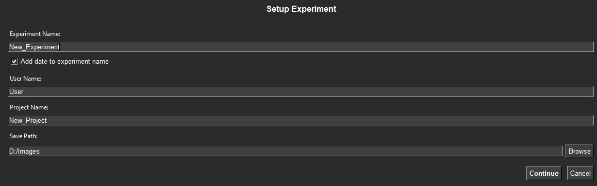
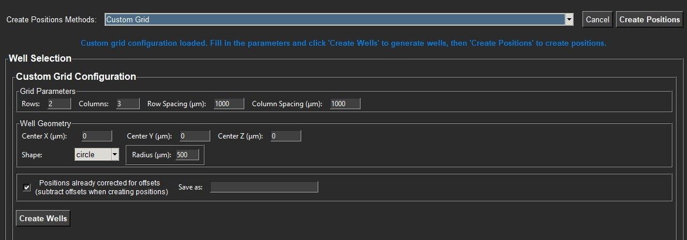
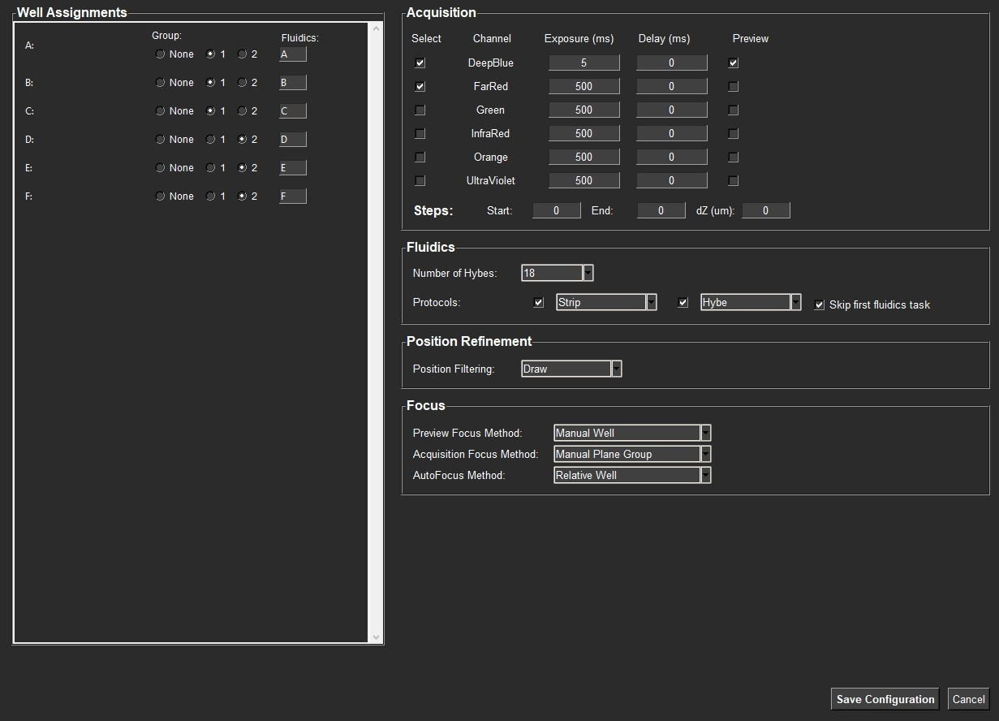
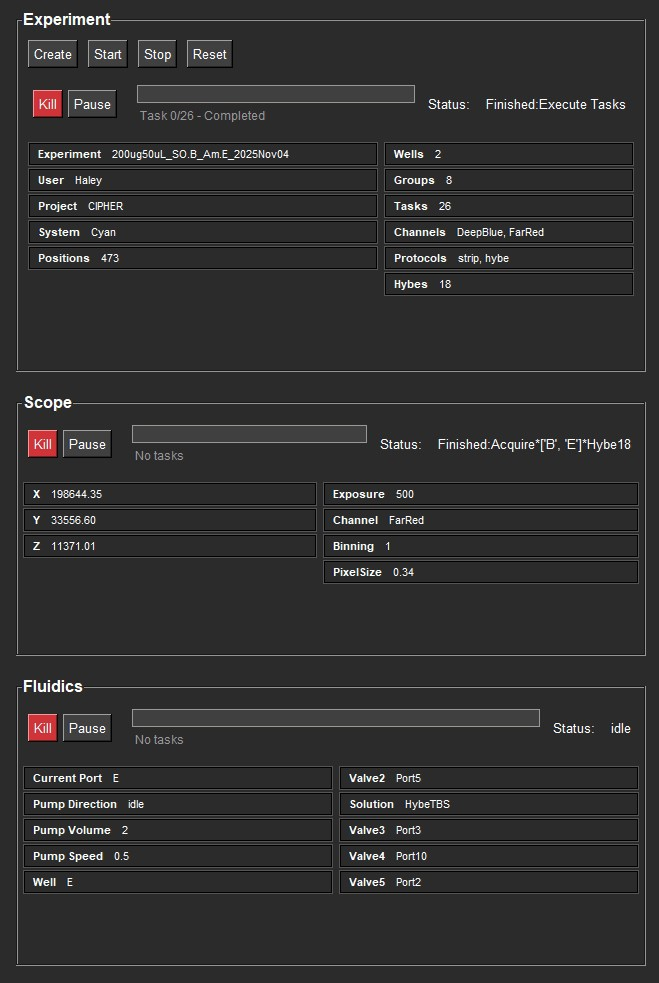

# pyScope: Automated Microscope Control System

## Overview

pyScope is a comprehensive Python-based automated microscope control system designed for high-throughput imaging experiments on well plates. The system integrates microscope control, fluidics management, position planning, and experiment orchestration into a unified platform with a modern graphical interface.

## Main Goals

The primary objectives of pyScope are:

1. **Automated Experiment Execution**: Orchestrate complex multi-round imaging experiments with integrated fluidics protocols
2. **Precise Position Management**: Generate and manage imaging positions for various well plate configurations with automatic tiling
3. **Microscope Integration**: Provide seamless control of microscope parameters (position, channels, exposure, binning) via Micro-Manager
4. **State Persistence**: Maintain experiment state across sessions with robust file-based state management
5. **Modern GUI Interface**: Offer an intuitive graphical interface with real-time monitoring and control
6. **Modular Architecture**: Enable independent operation of system components (scope, fluidics, experiment management)

## System Architecture

### Core Components

#### 1. **Experiment Class** (`experiment.py`)
- **Purpose**: Central orchestrator for experiment management
- **Key Capabilities**: 
  - Multi-round experiment support with group-based processing
  - Task creation and scheduling for Scope and Fluidics systems
  - Status monitoring and coordination (Running, Paused, Stopped, Reset, Recover)
  - Progress tracking for fluidics and scope tasks
  - File-based communication with scope and fluidics components
  - System recovery and reset capabilities
- **Documentation**: See [System Operation Flow](#system-operation-flow) for experiment management details

#### 2. **Scope Module** (`Scope/`)
- **Purpose**: Microscope control and image acquisition
- **Key Capabilities**: Micro-Manager integration, autonomous operation, protocol-based execution, position management, autofocus
- **Documentation**: See [Scope/README.md](Scope/README.md) for detailed documentation

#### 3. **Processing Module** (`Processing/`)
- **Purpose**: Image processing, stitching, and registration
- **Key Capabilities**: 
  - Autonomous image stitching with flat-field correction
  - Image processing pipelines (background subtraction, filtering)
  - Image registration for position correction
  - Interactive tools for ROI selection and coordinate selection
  - File-based communication for automated workflows
- **Documentation**: See [Processing/README.md](Processing/README.md) for detailed documentation

#### 4. **FileHandler Class** (`file_handler.py`)
- **Purpose**: Centralized file operations and data persistence
- **Key Capabilities**: State management, task tracking, plate configuration storage, logging

#### 5. **GUI Module** (`gui.py`)
- **Purpose**: Modern graphical user interface for system control
- **Key Capabilities**: Real-time monitoring, experiment configuration, system control, progress visualization

#### 6. **Fluidics Module** (`Fluidics/`)
- **Purpose**: Automated fluid handling and protocol execution
- **Key Capabilities**: Protocol-based fluid handling, pump/valve control, autonomous operation
- **Documentation**: See [Fluidics/README.md](Fluidics/README.md) for detailed documentation

### Data Flow

```
GUI Interface → Experiment Configuration → Task Generation → Component Execution
       ↓                    ↓                        ↓                    ↓
System Control    State Persistence    Progress Tracking    Data Storage
       ↓                    ↓                        ↓                    ↓
Launch/Kill      File Communication    Status Monitoring    Results Output
```

### Component Communication Architecture

The pyScope system uses a **file-based communication** approach where components run independently and communicate through shared files in the `State` directory:

#### Independent Component Operation
- **GUI** (`gui.py`): Main interface, manages experiment creation and system control
- **Experiment** (`experiment.py`): Runs with GUI, manages experiment state and task creation
- **Scope** (`Scope/scope.py`): Runs independently, monitors for scope tasks via continuous monitoring
- **Fluidics** (`Fluidics/fluidics.py`): Runs independently, monitors for fluidics tasks via file_handler integration
- **Processing** (`Processing/processing.py`): Runs independently, monitors for processing tasks via continuous monitoring

#### File-Based Communication Flow
1. **GUI** initializes system-specific components (Experiment, Scope, Fluidics, Processing)
2. **Experiment** creates high-level tasks and writes them to `Experiment_tasks.csv`
3. **Experiment** creates task triggers for Scope, Fluidics, and Processing via status files
4. **Scope**, **Fluidics**, and **Processing** monitor their respective status files and execute tasks independently
5. **Components** update status and progress files for GUI monitoring
6. **GUI** provides real-time status updates and progress tracking

For detailed communication protocol information, see the respective module documentation.

#### Benefits of This Architecture
- **Modularity**: Each component can be started/stopped independently
- **Reliability**: File-based communication is robust and recoverable
- **Debugging**: Easy to inspect communication files for troubleshooting
- **Scalability**: Components can run on different machines if needed
- **Flexibility**: Easy to add new components or modify communication protocols

## Key Features

pyScope provides a comprehensive platform for automated microscopy experiments:

- **Automated Experiment Execution**: Orchestrate multi-round imaging experiments with integrated fluidics
- **Position Management**: Automatic tiling and position generation from plate configurations
- **Microscope Control**: Full Micro-Manager integration with autonomous operation
- **Image Processing**: Stitching, processing, and registration capabilities
- **State Persistence**: Robust file-based state management and recovery
- **Modern GUI**: Intuitive interface with real-time monitoring

For detailed feature information, see the [module documentation](#module-documentation) sections.

## File Structure

```
pyScope/
├── README.md              # Main documentation (this file)
├── experiment.py          # Main experiment orchestrator
├── gui.py                 # Modern graphical interface
├── file_handler.py        # File operations and state management
├── run_experiment.bat     # Windows batch file for easy launching
├── Scope/                  # Scope-related modules
│   ├── README.md          # Scope module documentation
│   ├── scope.py           # Microscope control (base class)
│   ├── cyanscope.py       # Cyan-specific scope implementation
│   ├── positions.py       # Position planning and management
│   └── autofocus.py       # Autofocus strategies
├── Processing/            # Image processing modules
│   ├── README.md          # Processing module documentation
│   ├── stitching.py      # Image stitching functionality
│   ├── image_processing.py # Image processing pipeline
│   ├── image_registration.py # Image registration
│   └── segmentation.py    # Segmentation (placeholder)
├── Fluidics/              # Fluidics-related modules
│   ├── README.md          # Fluidics module documentation
│   ├── fluidics.py        # Base fluidics class
│   ├── cyanfluidics.py    # Cyan-specific fluidics implementation
│   ├── GUI.py            # Legacy fluidics GUI
│   ├── Protocols/        # Protocol definitions
│   ├── Pumps/            # Pump control modules
│   └── Valves/           # Valve control modules
├── State/                  # Runtime state files
│   ├── Experiment_state.json
│   ├── Scope_state.json
│   ├── Positions.csv
│   └── [task and status files]
└── Plates/               # Plate configurations
    ├── README.md          # Plate configuration documentation
    ├── example.json       # Example plate configuration (circle and rectangle wells)
    ├── Testing.json       # Testing plate configuration
    └── Underwood6.json    # Underwood 6-well plate configuration
```

## System-Specific Architecture

The pyScope system uses dynamic class loading to support different microscope setups:

### System Detection and Initialization
- **Automatic Detection**: System name derived from PC hostname (e.g., "CyanScope" → "Cyan")
- **Dynamic Loading**: GUI automatically loads appropriate system-specific classes
- **Modular Design**: Each system can have custom implementations of Scope and Fluidics

### System-Specific Classes
- **Scope Classes**: `CyanScope`, `OrangeScope`, etc. (inherited from base `Scope`)
- **Fluidics Classes**: `CyanFluidics`, `OrangeFluidics`, etc. (inherited from base `Fluidics`)
- **GUI Integration**: System-specific GUI initialization with appropriate components

For implementation details, see [Scope/README.md](Scope/README.md) and [Fluidics/README.md](Fluidics/README.md).

## Usage Examples

### Quick Start

**Prerequisites**: Micro-Manager must be running before launching pyScope.

```bash
# Windows: Easy launch
run_experiment.bat

# Manual launch
python experiment.py
```

The GUI will automatically detect your system type and initialize the appropriate components. For detailed usage examples and API documentation, see the [module documentation](#module-documentation) sections.

## GUI Interface

The pyScope GUI provides an intuitive interface for configuring and monitoring experiments. The interface is organized into several key panels:

### Initial Setup Panel

The initial setup panel allows you to configure basic experiment parameters before creating an experiment:



**Configuration Options:**
- **Experiment Name**: Set the name for your experiment (with optional automatic date appending)
- **User Name**: Specify the user running the experiment
- **Project Name**: Assign the experiment to a project
- **Save Path**: Configure where experiment data will be saved

### Position Creation Panel

The position creation panel provides tools for generating imaging positions. The Custom Grid method allows you to create a grid of positions with configurable parameters:



**Custom Grid Configuration:**
- **Grid Parameters**: Define rows, columns, and spacing (in µm)
- **Well Geometry**: Set center coordinates (X, Y, Z), shape (circle/rectangle), and dimensions
- **Position Correction**: Option to account for system offsets when creating positions
- **Save Configuration**: Save custom grid configurations for reuse

### Experiment Setup Panel

The experiment setup panel is where you configure the detailed parameters for your experiment:



**Configuration Sections:**

1. **Well Assignments**: Assign wells to experimental groups and configure fluidics ports
2. **Acquisition Settings**: 
   - Configure channel settings (exposure time, delay, preview options)
   - Set acquisition steps (start, end, dZ for z-stacking)
3. **Fluidics Configuration**:
   - Set number of hybridization rounds
   - Configure protocols (Strip, Hybe, etc.)
   - Option to skip first fluidics task
4. **Position Refinement**: Configure position filtering methods
5. **Focus Settings**: Set preview, acquisition, and autofocus methods

### Device Status Panel

The main status panel provides real-time monitoring of all system components:



**Monitoring Sections:**

1. **Experiment Section**:
   - Experiment parameters (name, user, project, system, positions, wells, groups, tasks, channels, protocols, hybes)
   - Control buttons (Create, Start, Stop, Reset, Kill, Pause)
   - Progress tracking (task completion status)
   - Overall experiment status

2. **Scope Section**:
   - Current coordinates (X, Y, Z)
   - Scope settings (exposure, channel, binning, pixel size)
   - Control buttons (Kill, Pause)
   - Progress tracking and status

3. **Fluidics Section**:
   - Pump settings (direction, volume, speed)
   - Current port and well information
   - Valve positions (Valve2-5)
   - Solution information
   - Control buttons (Kill, Pause)
   - Progress tracking and status

All panels provide real-time updates and allow for interactive control of the experiment execution.

## System Operation Flow

### High-Level Workflow

1. **System Launch**: GUI automatically detects system type and initializes components
2. **Experiment Configuration**: Configure groups, rounds, protocols, and channels via GUI
3. **Position Management**: Load plate configurations or create positions manually
4. **Task Generation**: Experiment creates tasks for Scope and Fluidics components
5. **Component Execution**: Scope and Fluidics execute tasks autonomously via file-based communication
6. **Progress Monitoring**: GUI provides real-time status updates and progress tracking

### Experiment Management

The Experiment class orchestrates multi-round imaging experiments with integrated fluidics protocols:

**Key Concepts:**
- **Groups**: Organize wells into experimental groups for different treatments
- **Rounds**: Multiple hybridization/imaging rounds (e.g., Round 1, Round 2, etc.)
- **Protocols**: Combined fluidics and imaging protocols executed in sequence
- **Task Structure**: Tasks are organized by group and round, with coordination between Scope and Fluidics

**Task Types:**
- **Scope Tasks**: Imaging protocols (SetFocus, FilterPositions, SetupAutoFocus, Acquire)
- **Fluidics Tasks**: Fluid handling protocols (Hybe, Strip, Rinse, etc.)
- **Processing Tasks**: Image processing protocols (Stitch with optional position indexing)
- **Experiment Tasks**: High-level experiment events requiring coordination

**Task Execution Flow:**
1. Experiment creates tasks based on configuration (groups, rounds, protocols)
2. Tasks are saved to `Experiment_tasks.csv` with columns for each system (Scope, Fluidics, Processing)
3. Processing tasks are automatically added after each Scope Acquire command
4. First stitch for each group includes position indexing flag (`+idx_stitch`)
5. Experiment executes tasks sequentially, waiting for each system to complete before proceeding
6. Each task triggers the appropriate system via status file communication
7. Systems execute tasks independently and update status/progress files
8. Experiment monitors progress and coordinates multi-system workflows

For detailed protocol information, see [Scope/README.md](Scope/README.md) and [Fluidics/README.md](Fluidics/README.md).

### File-Based Communication

Components communicate through shared files in the `State` directory:

**Key Communication Files:**
- **`Experiment_tasks.csv`**: High-level experiment tasks with columns for Scope, Fluidics, and Processing protocols
- **`Experiment_state.json`**: Experiment configuration (groups, rounds, protocols, channels)
- **`Scope_status.txt`**: Current scope status (monitored by Experiment for coordination)
- **`Fluidics_status.txt`**: Current fluidics status (monitored by Experiment for coordination)
- **`Processing_status.txt`**: Current processing status (monitored by Experiment for coordination)
- **`Positions.csv`**: Well positions with coordinates for imaging
- **`Scope_tasks.csv`**: Detailed imaging tasks created by Scope from experiment tasks
- **`Scope_task_idx.txt`**: Current task index for progress tracking
- **`Processing_task_idx.txt`**: Current processing task index for progress tracking

For detailed communication protocol information, see the respective module documentation.

## Current Status

### Implemented Features
- ✅ Complete modular system architecture
- ✅ Micro-Manager integration for microscope control
- ✅ File-based communication and state persistence
- ✅ Modern GUI with real-time monitoring
- ✅ Multi-round experiment support
- ✅ System-specific class loading (CyanScope, OrangeScope, etc.)

### Partially Implemented
- ⚠️ **Segmentation**: Basic structure exists in Processing module, needs algorithm implementation

For detailed feature lists, see the [module documentation](#module-documentation) sections.

## Dependencies

### Core Dependencies
- `pandas`: Data manipulation and analysis
- `numpy`: Numerical computations
- `tkinter`: GUI framework (included with Python)
- `pycromanager`: Micro-Manager integration
- `scipy`: Scientific computing (image processing, optimization)
- `scikit-image`: Image processing algorithms
- `tifffile`: TIFF image I/O
- `matplotlib`: Plotting and visualization
- `tqdm`: Progress bars

### Optional Dependencies
- `threading`: Multi-threaded operations (included with Python)
- `logging`: Advanced logging capabilities (included with Python)

## Installation and Setup

### Prerequisites

1. **Install Cursor**: Download and install Cursor IDE
2. **Install GitHub Desktop**: Download and install GitHub Desktop for repository management

### Repository Setup

3. **Clone pyScope Repository**:
   ```bash
   # Using GitHub Desktop or command line
   git clone [repository-url]
   ```

### Python Environment Setup

4. **Create Conda Environment**:
   ```bash
   conda create -n pyscope_3.12 python=3.12
   conda activate pyscope_3.12
   ```

5. **Navigate to pyScope Directory**:
   ```bash
   cd pyScope
   ```

6. **Install Python Dependencies**:
   ```bash
   pip install -r requirements.txt
   ```

### Micro-Manager Installation

7. **Uninstall Existing Micro-Manager Installations**: Remove any previously installed versions of Micro-Manager

8. **Install Micro-Manager**:
   - Install `MMSetup_64bit_2.0.3_20250707`
   - Follow the installation wizard to complete setup

9. **Install Spinnaker SDK**:
   - Install `SpinnakerSDK_FULL_2.3.0.77_x64`
   - This is required for camera support

10. **Configure Micro-Manager**:
    - Open Micro-Manager
    - Go to **Tools** → **Options**
    - Enable **Run pycro-manager server on port 4827**
    - Update Micro-Manager configuration as needed for your hardware setup

### System-Specific Configuration

11. **Create Desktop Shortcut**:
    ```powershell
    .\create_shortcut.ps1
    ```
    This creates a desktop shortcut for running experiments.

12. **Create Scope Class for Your Device**:
    - Determine your PC name (e.g., if your PC is named "BlueScope")
    - Create a new file in the `Scope/` directory named `bluescope.py` (lowercase)
    - Create a class named `BlueScope` (PascalCase) that inherits from the base `Scope` class
    - See existing examples: `Scope/cyanscope.py` for reference

13. **Create Fluidics Class for Your Device**:
    - Determine your PC name (e.g., if your PC is named "BlueScope")
    - Create a new file in the `Fluidics/` directory named `bluefluidics.py` (lowercase)
    - Create a class named `BlueFluidics` (PascalCase) that inherits from the base `Fluidics` class
    - See existing examples: `Fluidics/cyanfluidics.py` for reference

### Launching the System

14. **Run Experiment**:
    - Double-click the "Run Experiment" shortcut on your Desktop
    - Or manually run:
      ```bash
      # IMPORTANT: Launch Micro-Manager first before running pyScope
      # Start Micro-Manager and ensure the core is running
      
      # Windows: Easy launch
      run_experiment.bat
      
      # Manual launch
      python experiment.py
      ```
    
    **Note**: pyScope requires Micro-Manager to be running before launch. The system will attempt to connect to the Micro-Manager core on startup. If Micro-Manager is not running, the scope will operate in simulation mode.

## Crash Instructions

In `Experiment_tasks.csv` delete the lines of the tasks already completed except for "Scope, Fluidics" and "SetupAutoFocus", Write "idle" on `Scope_status.txt` and `Experiment_status.txt`, On Pyscope launch everything and then press start

## Module Documentation

For detailed documentation on specific modules, see:

- **[Scope Module](Scope/README.md)**: Microscope control, position management, and autofocus
- **[Processing Module](Processing/README.md)**: Image stitching, processing, and registration
- **[Fluidics Module](Fluidics/README.md)**: Fluid handling and protocol execution
- **[Plates Directory](Plates/README.md)**: Plate configuration format and position generation

## Contributing

The pyScope system is designed for extensibility. Key areas for contribution:

1. **Segmentation Algorithms**: Implement segmentation algorithms in Processing module
2. **Hardware Integration**: Add support for additional microscope and fluidics hardware
3. **User Interface**: Enhance GUI with additional features and improved usability
4. **Image Processing**: Add advanced image processing and analysis capabilities
5. **Documentation**: Improve user guides and API documentation

## License

This project is licensed under the MIT License - see the LICENSE file for details.

## Contact

**Zachary Hemminger**  
Email: zehemminger@gmail.com